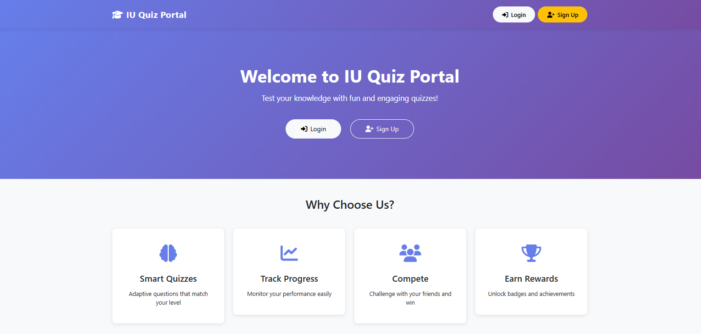

# IU Quiz Portal

**IU Quiz Portal** is a dynamic web application that allows users to attempt quizzes, track scores, and for admins to create, manage, and analyze quizzes. This project is built using **PHP**, **MySQL**, **Bootstrap**, and **JavaScript**.

---

## 🎯 Features

### User Features
- Sign up and login securely.
- Attempt quizzes using unique quiz codes.
- View scores and attempted quizzes.
- Prevents multiple attempts for the same quiz.
- Responsive design for all devices.

### Admin Features
- Create quizzes with up to 10 questions.
- Add multiple-choice options and define correct answers.
- View all quizzes created along with the number of users attempted.
- Delete quizzes along with all related data (questions, answers, user attempts).
- Real-time management using AJAX-based interface.

---

## 🛠️ Technologies Used
- **Frontend:** HTML5, CSS3, JavaScript, Bootstrap 5
- **Backend:** PHP (with session-based authentication)
- **Database:** MySQL / phpMyAdmin
- **Version Control:** Git & GitHub
- **Deployment:** InfinityFree

---

## 📂 Database Structure

**Tables:**
1. `users` - Stores user/admin credentials.
2. `quizzes` - Stores quiz information.
3. `questions` - Stores questions per quiz.
4. `answers` - Stores multiple-choice options for each question.
5. `user_attempts` - Stores user's submitted answers.
6. `submission` - Stores quiz submission summary (optional).

---

## 🌐 Live Demo
Check out the live project here: [Live Demo](https://quizportal-backend.kesug.com)

---

## 💻 Source Code
The full source code is available on GitHub: [Source Code Repository](https://github.com/Jadeja01/iu_quiz_portal)  

---

## 👥 Contributors
- [Tirthrajsinh Jadeja](https://github.com/Jadeja01)
- [Mukesh Teli](https://github.com/mukeshteli)

---

## 💡 Future Enhancements
- Add timer for each quiz attempt.
- Add email notifications for quiz results.
- Add analytics dashboard for admin to visualize performance.
- Implement JWT-based authentication for more secure sessions.

---

## 📌 Notes
- Admin users can create multiple quizzes and manage user attempts efficiently.
- Users can only attempt each quiz once.
